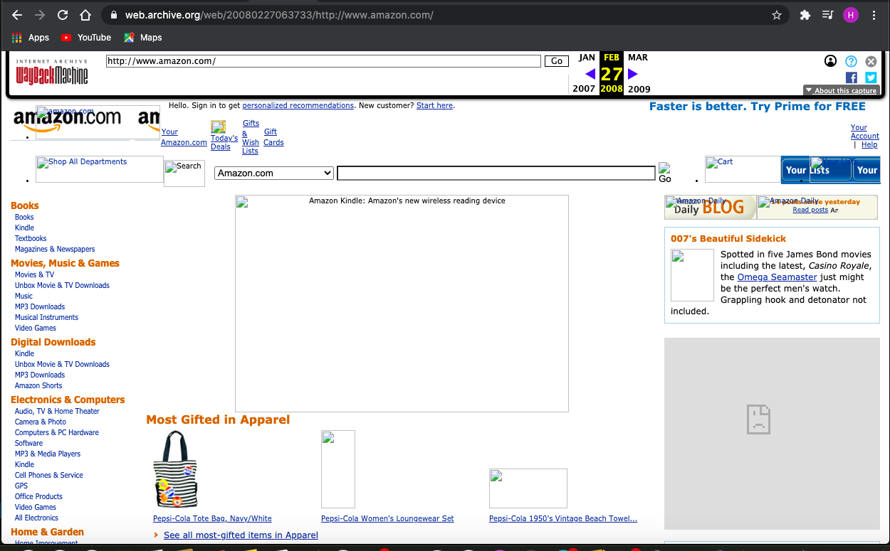

<!DOCTYPE html>
<html>
    <head>
        <title>readme.md</title>
    </head>
    <body>
<h1>The WayBack Machine</h1>
        
 Question 1: I went back to Feb. 27 2008 on the website Amazon.com. The website itself looks very retro compared to their 2021 website. The style, layout and overall presentation of the website has updated drastically. Amazon had just released the new "Amazon Wireless Kindle" as well as barbies, treadmills and a variety of books.

        <p2> Question 2: My experience with these last few topics has been very up and down. Concepts like internal linking, line breaks, and horizontal rules. All of those concepts got cleared up today, thanks to my meeting with you! 
         

        
 
